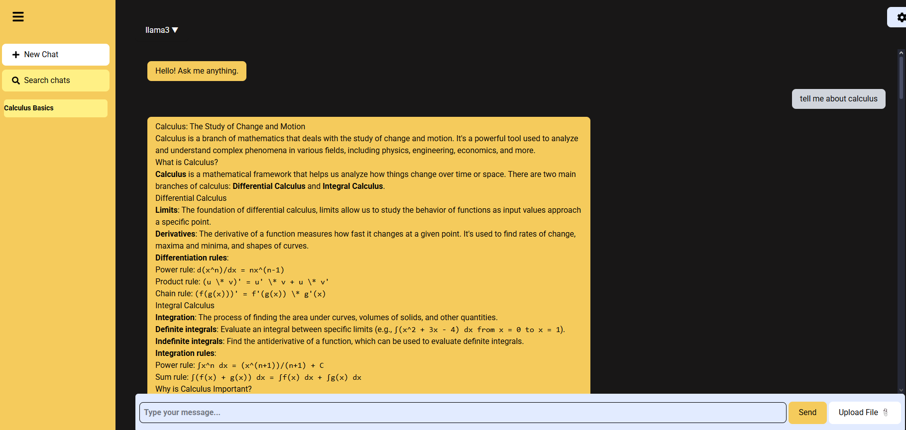

# AI CHATBOT
Author: My Lu  
Date: June 29, 202


## 📌 Overview
An interactive AI chatbot web applicaiton using LLMs (like Llama, GPT, Mistral) with a responsive React frontend and FastAPI backend. Designed to simulate intelligent conversations with support for chat memory, multiple model, and an intuitive UI

- [Demo Video]()
- [Project Report]()

## 📸 Preview



## 🚀 Getting Started
### Prerequisites
- Node.js & npm
- Python 3.11+
- Docker (optional, for deployment)


# 🌍 Secure Public Access via Cloudflare Tunnel (No Deployment Needed!)

You can share the app securely **without deploying to a server** using [Cloudflare Tunnel](https://developers.cloudflare.com/cloudflare-one/connections/connect-apps/install/).

### ✅ Backend Setup
1. Start FastAPI locally:
   ```bash
   uvicorn main:app --reload

2. Open a Cloudfare tunnel
    ```bash
    cloudflared tunnel --url http://localhost:8000

3. Copy the public URL (e.g. https://ceramic-loving-ahead-astronomy.trycloudflare.com) and set it as VITE_API_URL in your frontend .env.

### ✅ Frontend Setup
1. In `/frontend/vite.config.js`
    ```js
    export default defineConfig({
    plugins: [react()],
    server: {
        host: true,
        allowedHosts: 'all'
    }
    });

2. Create `.env`
    ```ini
    VITE_API_URL=https://your-tunnel-url.trycloudflare.com

3. Start React dev server:
    ```bash
    npm run dev

4. Run tunnel for frontend
    ```bash
    cloudflared tunnel --url http://localhost:5173

- Now your app is publicly available at 2 secutre links for backend + frontend


## 🚀 Deployment
Note: you can deploy the full-stack chatbot either using **Docker** (recommended) or manually on your local machine

### 🐳 Option 1 : Deploy with Docker (full stack)
1. In the project root, ensure you have:
    - `backend/Dockerfile`
    - `frontend/Dockerfile`
    - `docker-compose.yml` 
2. Run the following in the terminal from the project **root**
``` 
docker-compose up --build
```

3. Visit:
    - Frontend : `http://localhost:5173`
    - Backend : `http://localhost:8000/docs`


### 🧑‍💻 Option 2 : Manual Local Setup
 - Backend(FastAPI)
    ```
    cd backend
    python -m venv venv
    source venv/bin/activate        # On Windows: venv\Scripts\activate
    pip install -r requirements.txt
    uvicorn main:app --reload
    ```
    - The backend runs at: `http://localhost:8000`
    - Test via : `http://localhost:8000/docs`
- Frontend (React)
    ```
    cd frontend
    npm install
    npm run dev
    ```
    - The frontend runs at : `http://localhost:5173`

## 📁 Project Structure
```
chatbot/
├── backend/                          # FastAPI backend
│   ├── routes/                       # API route handlers
│   │   ├── auth.py                   # User login/authentication logic
│   │   ├── chat.py                   # Chatbot route (LLM processing)
│   │   ├── process_file.py           # File parsing, metadata extraction
│   │   ├── upload.py                 # File upload endpoint
│   │   ├── user.py                   # User registration or profile logic
│
│   ├── uploads/                      # Storage for uploaded files
│
│   ├── utils/                        # Backend helper modules
│   │   ├── database.py               # DB connection/session
│   │   ├── hasing.py                 # Password hashing utilities (bcrypt)
│   │   ├── memory.py                 # Memory storage for user chat history
│   │   ├── vision.py                 # Optional image parsing/LLM input prep
│
│   ├── main.py                       # FastAPI application entry point
│   ├── models.py                     # SQLAlchemy DB models
│   ├── oauth2.py                     # OAuth2 password/token flow for login
│   ├── schemas.py                    # Pydantic schemas (request/response models)
│   ├── requirements.txt              # Python package dependencies
│   └── Dockerfile                    # Docker config for backend
│
├── frontend/                         # React frontend
│   ├── public/
│   │   └── mushroom.svg              # Static image for branding/UI
│
│   ├── src/
│   │   ├── assets/                   # Frontend image, model, or file assets
│   │
│   │   ├── components/               # Reusable UI components
│   │   │   ├── chatArea.jsx          # Main chat UI and send logic
│   │   │   ├── chatItems.jsx         # Single chat message item (user or bot)
│   │   │   ├── fileUpload.jsx        # Drag-and-drop file uploader
│   │   │   ├── modelSelector.jsx     # Dropdown to select LLM (e.g., GPT, Gemini)
│   │   │   ├── searchModal.jsx       # Search past messages or chat titles
│   │   │   ├── settingsPanel.jsx     # Toggle model settings (temp, top-p, etc.)
│   │   │   └── sideBar.jsx           # Chat session history / navigation
│   │
│   │   ├── App.jsx                   # Main wrapper with routing
│   │   ├── index.css                 # Tailwind and global styles
│   │   └── main.jsx                  # Renders the app into the DOM
│
│   ├── package.json                  # React app metadata and dependencies
│   ├── package-lock.json
│   ├── index.html                    # Entry HTML file
│   ├── Dockerfile                    # Docker config for frontend
│   └── .gitignore

```
  
    


### Tech Stack
| Category             | Tool/ Library                               |
| ---------------------| ------------------------------------------- |
|   Frontend           | React, TailwindCSS, ReactIcon               |
|   Backend            | FastAPI, Python 3.11, Pydantic, Uvicorn     |
|   LLM                | Ollama, Llamam, Mistral, GPT 3.5, GPT 4     |
|   Database           | SQLAlchemy, PostgresSQL, PgAdmin            | 


### ✨ Feature


## Flow Diagrams 
1. 🔐 Authorization Flow
``` javascript
User → [Login Form] → /auth/login → [Token Issued] → Stored in LocalStorage
                         ↓
             JWT/Session validated on each /chat request

```

2. 💬 Chat Flow
``` javascript
[User Types Message]
    ↓
Frontend sends POST → /chat with model, message, and history
    ↓
Backend verifies model + processes request
    ↓
Calls respective LLM API (e.g., Gemini or GPT)
    ↓
Returns response
    ↓
Frontend displays response and updates chat history

```

3. 📤 Send Message Flow (React)

``` javascript
    // handleSend()
    - Prevent default
    - Get message input
    - Append to history
    - Send POST request to /chat
    - Update UI with response
```


## 📁 Frontend Structure ( ``` /frontend```)

| File / Folder             | Description                              |
| ---------------------| ------------------------------------------- |
|   `src/components/chatArea.jsx`        |     main chat window : handles user input, dosplays messages. trigger send logic |
|   `src/components/chatItems`        |  Renders each individual chat message (from user or AI) in styled bubbles.    |
|   `src/components/fileUpload.jsx`        |  	File uploader component with drag-and-drop or browse support. Sends files to backend.    |
|   `src/components/modelSelector.jsx`        |  Dropdown to let users select between LLMs like Gemini, GPT, or LLaMA.    | 
|   `src/components/searchModel.jsx`        |   Model interface to search previous chat sessions or keywords in messages.   |
|   `src/components/settingsPanels`        |  	UI panel to adjust model-specific parameters    |
|   `src/components/sideBar.jsx`        |   Sidebar that lists saved chats and allows switching between sessions.|
|   `src/App.jsx`         | Main component that defines layout and routes to pages.         |
|   `src/main.jsx`         | React entry point — mounts the app to the DOM.      |
|   `src/index.css`         |Global styles and Tailwind CSS configuration.  |


## 📁 Backend Structure ( ``` /backend```)

| File                 | Description                               |
| ---------------------| ------------------------------------------- |
|   `main.py`           | Main FastAPI app file. CORS Middleware, mounts routes   |
|   `routes/chat.py`            | Chat endpoint logic - handles `/chat` POST requests     |
|   `routes/auth.py`                | Manages authentication logic such as login and token issuance using OAuth2 and JWT     |
|   `routes/process_file.py`           | 	Processes uploaded files (text, PDF, etc.) to extract readable content for the chatbot to analyze.            | 
|   `routes/upload.py`         | Handles file upload via multipart form data, stores them in the /uploads folder or database.                    |
|   `rotes/user.py`     |   Manages user-related functionality such as registration, profile fetching, or user metadata.                               |
| `models.py`| Contains SQLAlchemy models defining database schemas like User, Chat, Message, and UploadedFile.|
| `oauth2.py`|  Implements OAuth2-based password flow, token generation, and access control for protected endpoints.  |
| `schemas.py`| Defines Pydantic schemas used to validate incoming request bodies and structure response formats.|


## Database
| Category             | Description                              |
| ---------------------| ------------------------------------------- |
|   `users`           | 	Stores user credentials, email, hashed passwords, and metadata for login/authentication.     |
|   `message`   |   	Stores chat messages per session, including sender (user or AI), timestamp, and chat history context.   |

- ORM Used : SQLAlchemy
- Database : PostgresSQL
- Security Password : using `bcrypt` in `hashing.py`

### Evaluate Chatbot Accuracy with DeepEval
- Using DeepEval to measure repsonse quality using metrics like Answer Relevancym Faithfulness and Toxicity
``` python
from deepeval.metrics import AnswerRelevancyMetric
from deepeval.test_case import LLMTestCase
from deepeval.evaluator import evaluate

test_case = LLMTestCase(
    input="How do I apply to NASA internships?",
    actual_output="You can visit intern.nasa.gov to apply...",
    expected_output="Visit intern.nasa.gov for internship info."
)

evaluate(
    [test_case],
    [AnswerRelevancyMetric(threshold=0.7)]
)

```

#### Result Sample:
```yami
Answer Relevancy: score = 0.92
Faithfulness: score = 0.87
```


## 📚 What I Learned
 - **LLM Integration** : Integrated multiple large language model (LLMs) such as GPT, Mistral, Llama. Using Ollama to pull the model in local enviroment, and set up the REST API to send the request back and forth to the applicaiton
 - Cloudflare Tunnel :  Exposed full-stack app securely with no external server
 - Evaluation : Used DeepEval to validate and tune LLM resposnes for accuracy
 - **Structured Chat History** : desinged and maintained a conversation flow that supports contextual memory, allowing past messages to influence new replies using strucutre JSON message histories
 - **Implementing File Upload** : added support feature for file upload, enabling users to uplad documents or images as part of the conversation context
 -** API Request Handling **: Engineered a clean, modular approach to sending chat requests, model switching, and error handling on both the frontend and backend using FastAPI and React.
 - **Full-stack Architecture** : eveloped the entire application architecture, from user interface to backend endpoints and service logic—managing state, user input, loading states, and API data flow.
 - **Docker & Deployment** : Used Docker and Docker Compose to containerize the full app, enabling smooth deployment to cloud services or local environments without worrying about dependency mismatches.


## Author
**My Lu**  
Intern @ Ontash  
Website Portfolio : https://www.mylu004.com  
Email: myluwork004@gmail.com  
LinkedIn : www.linkedin.com/in/my-lu  
Github : https://github.com/MyLu004 
